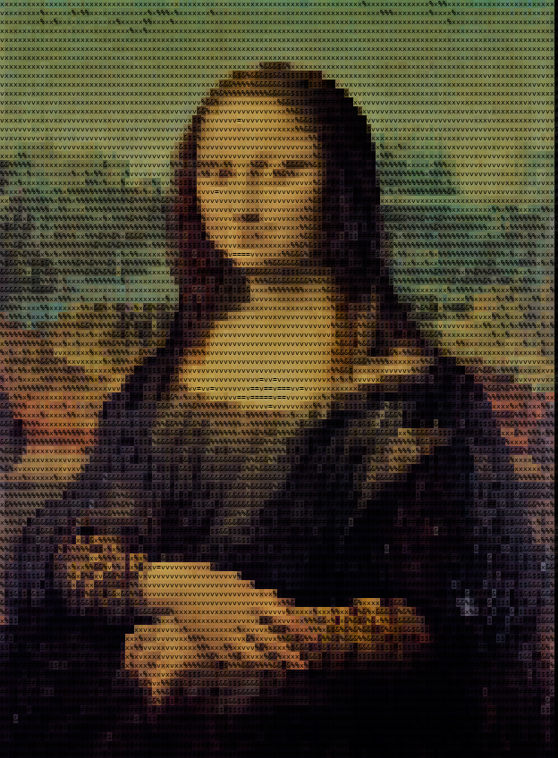
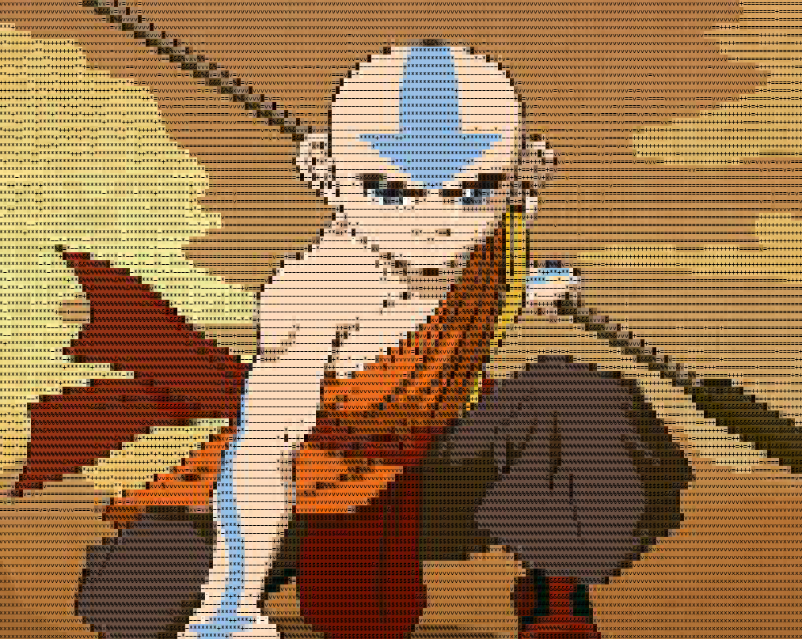

# Image to ASCII Converter

## Table of contents
* [Overview](#overview)
* [Examples (Screenshots of Terminal)](#examples (screenshots of terminal))
* [Technologies](#technologies)
* [Setup](#setup)
* [Supported Image Types](#supported image types)
* [Limitations](#limitations)

## Overview
This program takes images from the *./imgs/* folder and makes then into coloured ascii text drawings.  
There are photos that are already in the *./imgs/* folder and you can choose from these default photos; however, you can also add your own photos to the folder and the newly-added photo can be selected in the program. Additionally, you can select the image to be rendered in grayscale, 4-bit colour, or True Colour.

## Examples (Screenshots of Terminal)

  > Mona Lisa

  > Aang from Avatar: The Last Airbender

## Technologies
- **Python 3.8**
- **Pillow 6.2**
  - for image minipulation
- **glob**
  - for getting images from a folder
- **Ansi Escape Sequences**
  - for converting *RGB* colour to colour representable in terminals
  - generating 4-bit sequences from *RGB* is my own algorithm and allows the requirements to be limited to only **Pillow**

## Setup
To run this project, install the requirements and then run the program:

    pip3 install -r requirements
    python convert.py

## Supported Image Types
- [x] jpg *(JPG, jpeg...)*
- [x] png
- [x] gif
- [x] bmp
- [x] eps
- [x] icns
- [x] ico
- [x] im
- [x] msp
- [x] pcx
- [x] ppm
- [x] sgi
- [x] tiff  

## Limitations
- [ ] video file types
- [ ] multiple frames of gif
- rendering photos in True Colour slows down the terminal until *clear* is called
